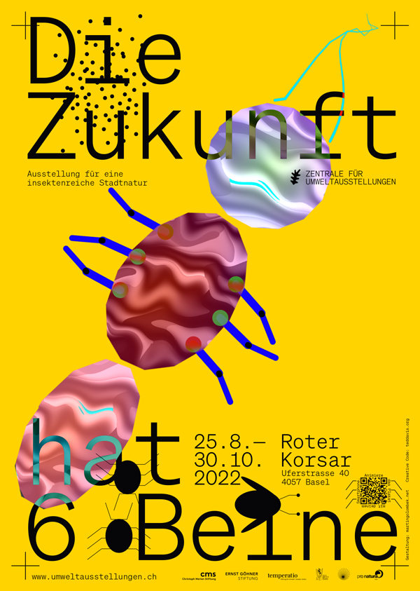

# GEN-AR
Generative Augmented Reality  
cc [teddavis.org](https://teddavis.org) // [ffd8](https://github.com/ffd8/) 2023

This is an overview for creating generative [Augmented Reality](https://en.wikipedia.org/wiki/Augmented_reality) (AR) experiences within the [mobile] web browser using open source tools ([p5.js](https://p5js.org/) + [mindAR](https://hiukim.github.io/mind-ar-js-doc/) + [A-Frame](https://aframe.io/)). With this workflow, one only needs to point the viewer to a URL (easily via QR-code) where the AR is loaded within a website using the camera by permission, removing the need to install custom apps. One of the main benefits of this workflow is ability to display real-time rendered content for your AR layer, enabling infinitely changing graphics based on any number of inputs such as time, weather, chance, audio, etc.  

[gen-ar.github.io](https://gen-ar.github.io)  
[github.com/gen-ar](https://github.com/gen-ar/)


## Table of Contents
- [Background](#background)
- [Workflow](#workflow)
- [Examples](#examples)
- [Hosting](#hosting)
- [Projects](#projects)
- [Extras](#extras)

## Background
This research began when [Martin Golombek](http://martingolombek.net/en) suggested collaborating on a poster for an exhibition about insects, [Die Zukunft hat 6 Beine](https://umweltausstellungen.ch/ausstellungen/insekten-biodiversitaet) (The Future has 6 Legs). He had explored AR for [another project](https://vimeo.com/286660943), but wondered if I was interested to develop generative insects that could walk across the poster when viewed through AR. I quickly recalled that most AR apps tend to serve a static/fixed media (image, video, 3d model) for the augmented layer and wondered if one could instead display generative (infinitely unique and changing) content instead?? Not to mention, would it be possible with only the mobile web browser, to avoid the need of each viewer downloading an app first. 

I started developing generative bugs (the good kind) with [p5.js](https://p5js.org/), a creative-coding JS framework and soon after discovered the amazing [MindAR](https://github.com/hiukim/mind-ar-js), which itself builds upon [A-frame](https://aframe.io/) for creating a browser based AR experience. The demos worked flawlessly for fixed assets and soon learned how to [use a canvas as texture in AFrame](https://wirewhiz.com/canvas-texture/), which simply required pointing to a pre-existing HTML5 Canvas element. *Getting closer.*

Attempts to use a p5.js canvas for the material kept failing since p5.js creates the canvas dynamically itself – even in instance mode, where one specifies where to place itself. Tricky, as A-Frame needed to already know the canvas element's ID (I think dynamically setting this had also failed). Research on this issue led to a [discussion](https://discourse.processing.org/t/creategraphics-referencing-existing-canvas-context/21067) and proposed pull request to [support existing canvas elements for createGraphic](https://github.com/processing/p5.js/issues/4564) by @valentinptc in 2020, which unfortunately never got merged. Nevertheless, [their code snippet](https://github.com/processing/p5.js/pull/4563/commits/0c3a8630655b16b4f74630705f6d4ab2426e827d) was available, which worked perfect upon testing. This was then carefully added to a custom min version of p5.js (1.4.0) with a few tweaks due to the code base changes since that initial PR. 

Everything was great until the animation suddently stopped working due to an update in A-Frame that stopped grabbing the latest render from the canvas... ugh. More research led to the need of implementing a compontent called [update-canvas](https://github.com/aframevr/aframe/blob/b164623dfa0d2548158f4b7da06157497cd4ea29/examples/test/canvas-texture/components/canvas-updater.js).

Voila! It was now possible to load dynamic p5.js content into the AR layer from the mobile web browser! Here a [video screengrab](https://vimeo.com/738953265) of the p5.js + [hydra](https://hydra.ojack.xyz/) generative AR layer content. And documentation of [this poster in the wild](https://www.instagram.com/p/Chngq0Fg0OI/)!

It was hacky, but it worked! It required drawing everything to a `createGraphics()` layer, but it worked. It had conflicts with mobile orientation changes, but it worked. etc etc.

Soon after, Martin and I gave a [Winter Workshop](https://baselwinterworkshops.ch) at the [Institute Digital Communication Environments, HGK FHNW](https://www.fhnw.ch/en/about-fhnw/schools/academy-of-art-and-design/institute-digital-communication-environments) on the topic of [Generative AR Posters](https://www.instagram.com/p/CmOxRAwo0vb/). We introduced participants to this unique realm of possibilities, the notion of AR posters with generative content based on time through creative-coding using p5.js. Of course p5.js had updated itself in the meantime, which required yet another surgical implementation and update to the hack allowing for passing an existing canvas. In the workshop we explored and discovered together the ability to have multiple layers of content in the AR experience, offset in position, rotation and depth. Check out the [amazing workshop outputs](https://gen-ar.github.io/garp-01/) from our participants!

Cut to summer 2023, a new generative AR project is in the works (*will share after launch in Nov '23*), and it was time to try and make this hack officially part of p5.js, both for replacing the need to reimplement upon updates and to enable others to play with this workflow. The [discussion continued](https://github.com/processing/p5.js/issues/4564#issuecomment-1593640191) for potentially being implemented in version 1.7.0 and a new [pull request](https://github.com/processing/p5.js/pull/6229) was created, this time also enabling the main `createCanvas()` to be passed into an existing canvas, thus making the workflow even easier for beginners. [Here's a demo](https://editor.p5js.org/ffd8/full/PbqrLrTIQ) that uses multiple layers, passed as textures on multiple shapes within A-Frame.

Fall 2023 and prepping for a [workshop at Weltformat Festival](https://weltformat-festival.ch/en/2023/workshops/generative-ar-poster) gives the motivation to finally document this whole process and workflow. Have fun exploring this wild domain and [let me know](#extras) if you create something fun with it?!

## Workflow
The basic workflow goes as follows *(or simply clone an [example](#examples) below)*:

- Create working directory
- Create a `js/sketch.js` to hold your p5.js sketch
- Create a `data/targets.mind` from your image using the [online generator](https://hiukim.github.io/mind-ar-js-doc/tools/compile)
- Create an `index.html` with basic structure
- Add the following snippets to each section

#### index.html `<head>` tag:

*Load A-Frame + MindAR + p5.js*

```html
<script src="https://aframe.io/releases/1.4.2/aframe.min.js"></script>
<script src="https://cdn.jsdelivr.net/npm/mind-ar@1.2.3/dist/mindar-image-aframe.prod.js"></script>
<script src="https://cdnjs.cloudflare.com/ajax/libs/p5.js/1.7.0/p5.min.js"></script>
```

*Load your sketch (or botton of body tag, ?# to bypass cache during dev*

```html
<script src="js/sketch.js?1"></script>
```

*A-Frame continuous loading output of p5 canvas*

```html
<script type="text/javascript">
	AFRAME.registerComponent('canvas-updater', {
		dependencies: ['geometry', 'material'],

			tick: function () {
				var material, el = this.el;
				material = el.getObject3D('mesh').material;
				if (!material.map) { return; }
					material.map.needsUpdate = true;
			}
		});
</script>
```

#### index.html `<body>` tag:

*Create canvas to hold the p5.js content*

```html
<canvas id="canvas-ar" style="display:none;"></canvas>
```

*MindAR + A-Frame tracking, use ?# to bypass cache during dev*  
*Create your targets.mind file: [https://hiukim.github.io/mind-ar-js-doc/tools/compile](https://hiukim.github.io/mind-ar-js-doc/tools/compile)*

```html
<a-scene mindar-image="imageTargetSrc: data/targets.mind?1; filterMinCF:0.0005; filterBeta: .1;" vr-mode-ui="enabled: false" device-orientation-permission-ui="enabled: false">
	<a-camera position="0 0 0" look-controls="enabled: false"></a-camera>
	<a-entity id="example-target" mindar-image-target="targetIndex: 0">
      	
	<!-- p5.js canvas as texture on plane, width + height ratio for F4/Weltformat poster -->
	<a-plane width="1" height="1.4145" position="0 0 0" scale="1.05 1.05 1.05" rotation="0 0 0" material="src:#canvas-ar;transparent: true;" canvas-updater></a-plane>
	</a-entity>
</a-scene>
```

#### sketch.js `setup()`:

*create canvas with poster ratio, render to existing canvas*  
*optionally prevent 200+ PPI (double) sized canvas on mobile for better performance*
 
```js
// 
createCanvas(895, 1280, document.getElementById('canvas-ar'))
pixelDensity(1)

```
*That's it..!* ... ahem, technically. You'll still need to run the folder as a local webserver for testing. For that I recommend using [Visual Studio Code](https://code.visualstudio.com/download) + the [Live Server](https://marketplace.visualstudio.com/items?itemName=ritwickdey.LiveServer) extension. (Or with [MAMP](https://www.mamp.info/en/downloads/), or if you have Python/PHP installed, using CLI to [run the folder as a webserver](https://dev.to/alexmercedcoder/guide-to-starting-a-quick-http-dev-server-from-the-command-line-python-node-ruby-php-3o87)). For advanced usage and testing with your smartphone, check out [ngrok](https://ngrok.com/).

## Examples
[Download the examples](https://github.com/gen-ar/gen-ar-examples/releases/download/0.1.0/gen-ar-examples.zip) to get up and running! For now they are focused on an F4/Weltformat sized poster, but simply adjust the `a-plane width="1" height="1.4145"` ratio to match your tracked image.

<table>
    <tr style="font-weight:bold;">
        <td>SOURCE</td>
        <td>DESCRIPTION</td>
        <td>DEMO</td>
    </tr>
    <tr>
        <td><a href="https://github.com/gen-ar/gen-ar-examples/tree/main/p5js-poster-global">p5js-poster-global</a></td>
        <td>Main canvas, as normally used with p5</td>
        <td><a href="https://gen-ar.github.io/gen-ar-examples/p5js-poster-global/"></a></td>
    </tr>
    <tr>
        <td><a href="https://github.com/gen-ar/gen-ar-examples/tree/main/p5js-poster-layer">p5js-poster-layer</a></td>
        <td>AR using <code>createGraphics()</code> layer</td>
        <td><a href="https://gen-ar.github.io/gen-ar-examples/p5js-poster-layer/"></a></td>
    </tr>
    <tr>
        <td><a href="https://github.com/gen-ar/gen-ar-examples/tree/main/p5js-poster-layer-multi-xy">p5js-poster-layer-multi-xy</a></td>
        <td>Offset AR layers to left/right/top/bottom of image</td>
        <td><a href="https://gen-ar.github.io/gen-ar-examples/p5js-poster-layer-multi-xy/"></a></td>
    </tr>
    <tr>
        <td><a href="https://github.com/gen-ar/gen-ar-examples/tree/main/p5js-poster-layer-multi-z">p5js-poster-layer-multi-z</a></td>
        <td>Offset AR layers in Z-Axis towards camera</td>
        <td><a href="https://gen-ar.github.io/gen-ar-examples/p5js-poster-layer-multi-z/"></a></td>
    </tr>
</table>


All demos reference the original poster artwork for how this research began. You can print it out, save it to your mobile, or use the QR codes above to send your mobile device to the demo and point the camera at this image:



*See bottom of [workflow](#workflow) above for running an example as a local webserver, since it doesn't work to just drag + drop in browser.*

## Hosting
This workflow uses only static HTML pages, so it can be uploaded to just about any webhosting service. One free option is to host it using GitHub's own Pages feature:

- [Create a Github Account](https://github.com/signup)
- [Download Github Desktop App](https://desktop.github.com/) and launch, sign-in
- `File` Menu » `New Repository...` » select directory
- `Publish Repository` to GitHub
- Github Repo » `Settings` » `Pages` » `Default Branch` select `Main`
- Visit `https://username.github.io/reponame`
- [Create QR code](https://www.qrcode-monkey.com/) for easy referral on smartphone


## Projects
A collection of works that utilize this workflow can be found here:  

- [Die Zukunft hat 6 Beine](https://www.instagram.com/p/Chngq0Fg0OI/)
- [Generative AR-Posters, IDCE Winter Workshop 2023](https://gen-ar.github.io/garp-01/)
- [Sondershop 3000](https://www.instagram.com/p/CwaepuAMCa4)

## Extras 
### Contributing
Found a bug, missing feature, and/or created a project with GEN-AR?  
Let me know!   Create an [issue on GitHub](https://github.com/gen-ar/gen-ar.github.io/issues).

### License

This project is licensed under GNU General Public License v3.0 - see [LICENSE.md](https://github.com/gen-ar/gen-ar.github.io/blob/main/LICENSE) for details.